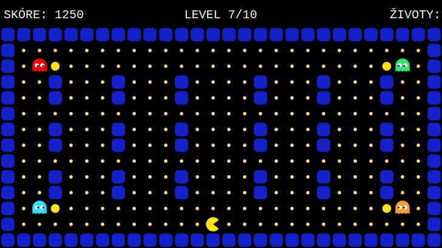

# Pac-Man

Klon klasické arkádové hry Pac-Man napsaný v čistém JavaScriptu (ES moduly), který
běží celý na HTML `<canvas>`. Bez frameworků, bez závislostí, bez build kroku.

Hra obsahuje 10 úrovní s postupně rostoucí obtížností – přibývá duchů, houstne
bludiště a zrychlují se protivníci.

**▶️ Zahrát online: <https://joseftraxler.github.io/pacman/>**



## Ovládání

| Akce      | Klávesy                     |
|-----------|-----------------------------|
| Pohyb     | šipky nebo `W` `A` `S` `D`  |
| Pauza     | `mezerník` nebo `Enter`     |
| Start / pokračování / restart | `mezerník` nebo `Enter` |

Cílem je sníst všechny tečky v úrovni a přitom se vyhnout duchům. Po dokončení
úrovně se stiskem klávesy pokračuje na další; po zdolání poslední úrovně hra končí
vítězstvím. Srážka s duchem stojí jeden život, po ztrátě všech tří životů hra končí.

Ve všech úrovních je **ovoce** 🍒🍓🍊🍎 v rozích (power-pelety). Po jeho snědení se
duchové na několik sekund vystraší – zmodrají, zpomalí a utíkají. V tu chvíli je
můžeš sníst za bonusové body (200 → 400 → 800 → 1600 za každého dalšího v jednom
režimu); snědený duch se v podobě očí vrátí na svůj start a ožije. Ovoce je
**volitelné** – k dokončení úrovně stačí sníst všechny tečky, ovoce sníst nemusíš.

## Spuštění

Hra používá ES moduly, které prohlížeč **nenačte přes `file://`** – je potřeba
statický HTTP server. Nejjednodušší varianty:

```bash
# Python 3
python3 -m http.server 8000
```

```bash
# Node.js (balíček serve)
npx serve
```

Poté otevři `http://localhost:8000` v prohlížeči.

## Struktura projektu

```
index.html              vstupní stránka s <canvas>
css/styles.css          roztažení plátna přes celé okno
js/
├── scripts.js          bootstrap – canvas, ovládání, seznam levelů, spuštění hry
├── game.js             Game – herní smyčka, stavy, kolize, vykreslování prostředí
├── level.js            Level – parsování mapy a rychlosti duchů
├── directions.js       směry pohybu + pomocné funkce
├── input.js            mapování kláves na akce
├── entities/
│   ├── entity.js       Entity – základní plynulý pohyb po mřížce (abstraktní draw)
│   ├── player.js       Player – ovládání a vykreslení pacmana
│   └── ghost.js        Ghost – AI duchů a jejich vykreslení
└── levels/
    └── level1.js … level10.js   definice jednotlivých úrovní
```

Zodpovědnosti jsou rozdělené: `Game` řídí hru a entitám říká, kam se mají
vykreslit, zatímco každá entita se stará jen sama o sebe (svůj pohyb a vzhled).

## Formát úrovně

Úroveň je instance třídy `Level`. Prvním argumentem je rychlost duchů v procentech
rychlosti hráče (100 = stejně rychlí jako hráč), následují řádky mapy:

```js
import {Level} from "../level.js";

const level1 = new Level(
    45,                             // rychlost duchů v % rychlosti hráče
    "############################",
    "#--------------------------#",
    "#------------P-------------#",
    "#----------------------R---#",
    "############################",
);

export {level1};
```

Legenda znaků mapy:

| Znak      | Význam                                   |
|-----------|------------------------------------------|
| `#`       | zeď                                      |
| `-`       | tečka ke snědení (nutná k dokončení)     |
| `*`       | ovoce / power-peleta (vystrašený režim, volitelné) |
| `P`       | startovní pozice hráče                    |
| `R`       | duch – červený                           |
| `G`       | duch – zelený                            |
| `B`       | duch – modrý                             |
| `O`       | duch – oranžový                          |
| (mezera)  | prázdné průchozí políčko (bez tečky)     |

### Přidání vlastní úrovně

1. Vytvoř soubor `js/levels/levelX.js` podle vzoru výše.
2. V `js/scripts.js` ho naimportuj a přidej do pole `levels`.

Pořadí v poli určuje pořadí úrovní ve hře.

## Licence

Projekt je dostupný pod licencí [MIT](LICENSE).

## Poznámka

Jde o studijní/hobby projekt. „Pac-Man" je ochranná známka společnosti Bandai
Namco; tento klon není nijak spojený s držitelem práv ani jím podporovaný.
